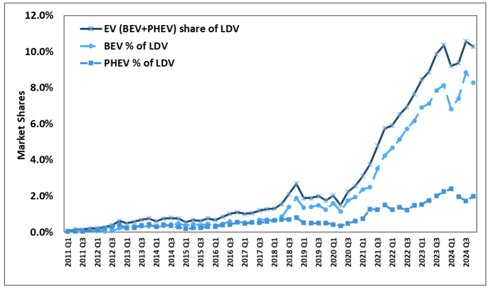

```{r, child="setup.Rmd"}
```

# Text

---

background-image: url("images/top-four-1.png")
background-size: cover

---

background-image: url("images/top-four-2.png")
background-size: cover

---

# .center[Countering China & Investing in Manufacturing]

<br>

## **IRA Strategy**: Investing in *manufacturing* will lead to enduring support for clean tech through local jobs & economic benefits

--

## To what extent are counter-China policies helping or harming the clean tech manufacturing goal?

---

background-color: #fff

<center>

</center>

---

background-color: #fff

## .center[EV sales in US reaching ~10% of sales]

<center>

</center>

.font80[Source: Argonne National Lab, https://www.anl.gov/ev-facts/model-sales]

---

class: center
background-color: #fff

## EV sector has an affordability problem (except in China)

.font70[Price gap between the sales-weighted average price of BEV and ICEV, before subsidy, by size, in 2018 and 2022]

<center>

</center>

.font70[Source: IEA, https://www.iea.org/reports/global-ev-outlook-2024/executive-summary]

---

.leftcol75[

<center>

</center>

.font60[Source: Roberson, Laura A., *Pantha, S., & Helveston, J.P. (2024) “Battery-Powered Bargains? Assessing Electric Vehicle Resale Value in the United States” Environmental Research Letters.]

]

.rightcol25[

### .center[Used market is more affordable, but post-COVID prices are up in all markets, not just EVs]

]

---

class: center
background-color: #fff

# There are still affordable EV deserts

<center>

</center>

---

# Things that don't help affordability:

<br>

--

## 100% tariff on imported Chinese EVs 

--

## Effectively banning the use of Chinese suppliers (inc. raw materials) in US EVs

--

## Inflation

---

## Chinese FDI into U.S.

### **Gotion batteries**: Multi-billion dollar investments in Illinois and Michigan

### Challenge: Uncertainty around Foreign Entities of Concern (FEOC) status

--

<br>

## Technology Licensing Agreements

### **Ford-CATL**: Licensing battery technology in a Michigan plant

### Challenge: CATL was recently added to DOD's list of “Chinese military companies”

---

class: middle, center, inverse

# The biggest competitor to an EV<br>is not a Chinese EV,<br>it's gas cars

---

class: inverse 
background-image: url("images/blue.jpg")
background-size: cover

<br>

# Thanks!

<br>

### slides.jhelvy.com/2025-princeton-industrial-policy

.footer-large[.white[.right[

@jhelvy.bsky.social `r fa(name = "bluesky", fill = "white")`<br>
@jhelvy `r fa(name = "github", fill = "white")`<br>
jhelvy.com `r fa(name = "link", fill = "white")`<br>
jph@gwu.edu `r fa(name = "paper-plane", fill = "white")`

]]]
