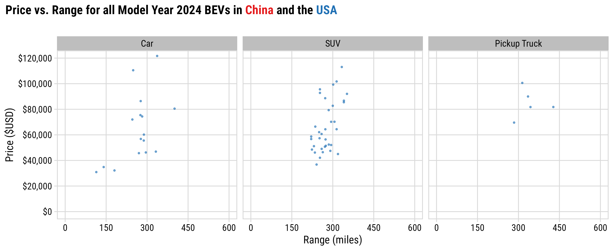
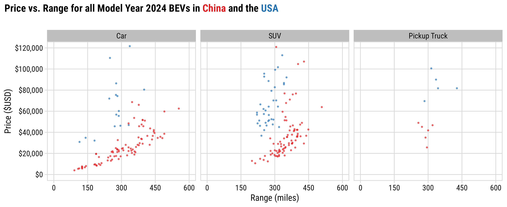
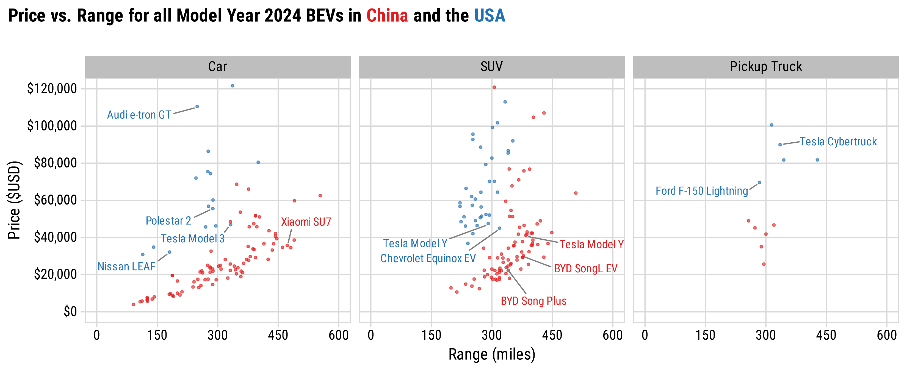

<style>
.tab {
    display: inline-block;
    margin-left: 8em;
}
</style>

```{r, child="setup.Rmd"}
```

---

# .center[China is posting some impressive EV numbers]

<br>

--

### PEV sales (BEV + PHEV): **1.37 M (2020) --> 12.9 M (2024)**

<div><span class="tab"><span class="tab"><span class="tab"></span>&nbsp;&nbsp;&nbsp;(46.7% of sales)</div>

--

<br>

### PEV exports (BEV + PHEV): **0.2 M (2020) --> 1.28 M (2024)**

<div><span class="tab"><span class="tab"><span class="tab"></span>&nbsp;&nbsp;&nbsp;(25% of vehicle exports)</div>

---

background-color: #fff

<center>

</center>

---

background-color: #fff

## .center[EV sales in US reaching ~10% of sales]

<center>

</center>

.font80[Source: Argonne National Lab, https://www.anl.gov/ev-facts/model-sales]

---

class: center

.leftcol70[

<center>

</center>

.font70[Source: https://www.iea.org/reports/global-ev-outlook-2024/executive-summary]

]

.rightcol30[

### The EV sector has an affordability problem<br>(except in China)

]

---

class: center
background-color: #fff

## BEVs Concentrated in High-Price Segments in US

<br>

**In 2024, only 2.2% of new and 3.6% of used listings under $45,000 were BEVs**

<center>

</center>

.font80[Data pulled from ~80k dealerships, 2016 to 2024. Source: marketcheck.com]

---

class: center

### China offers more affordable BEVs across all range categories

<center>

</center>

Data scraped from autocango.com (China) and carsheet.io (USA)

---

class: center

### China offers more affordable BEVs across all range categories

<center>

</center>

Data scraped from autocango.com (China) and carsheet.io (USA)

---

class: center

### China offers more affordable BEVs across all range categories

<center>

</center>

Data scraped from autocango.com (China) and carsheet.io (USA)

---


---


---

# Things that don't help affordability:

<br>

--

## Tariffs (100% tariff on imported Chinese EVs since 05/2024)

--

<br>

## Effectively banning the use of Chinese suppliers 

--

<br>

## Inflation (see tariffs)

---

## .center[**Opportunities**]

.leftcol[

## Chinese FDI into U.S.

### **Gotion batteries**: Multi-billion dollar investments in Illinois and Michigan

### **Challenge**: Uncertainty around Foreign Entities of Concern (FEOC) status

]

--

.rightcol[

## Technology Licensing Agreements

### **Ford-CATL**: Licensing battery technology in a Michigan plant

### **Challenge**: CATL was recently added to DOD's list of “Chinese military companies”

]

---

class: middle, center, inverse

# The biggest competitor<br>to an American EV<br>is not a Chinese EV...<br><br>...it's a gas car

---

background-image: url("images/top-four-1.png")
background-size: cover

---

background-image: url("images/top-four-2.png")
background-size: cover

---

class: inverse 
background-image: url("images/blue.jpg")
background-size: cover

<br>

# Thanks!

<br>

### <span class="white-text">https://jhelvy.github.io/2025-ucsd-us-china</span>

<style>
.white-text a {
  color: white !important;
}
</style>

.footer-large[.white[.right[

@jhelvy.bsky.social `r fa(name = "bluesky", fill = "white")`<br>
@jhelvy `r fa(name = "github", fill = "white")`<br>
jhelvy.com `r fa(name = "link", fill = "white")`<br>
jph@gwu.edu `r fa(name = "paper-plane", fill = "white")`

]]]

---

class: inverse, middle, center

# Extra Slides

---

.leftcol75[

<center>

</center>

.font60[Source: Roberson, Laura A., *Pantha, S., & Helveston, J.P. (2024) “Battery-Powered Bargains? Assessing Electric Vehicle Resale Value in the United States” Environmental Research Letters.]

]

.rightcol25[

### .center[Used market is more affordable, but post-COVID prices are up in all markets, not just EVs]

]

---

class: center
background-color: #fff

# The BEV Deserts of America

<center>

</center>
